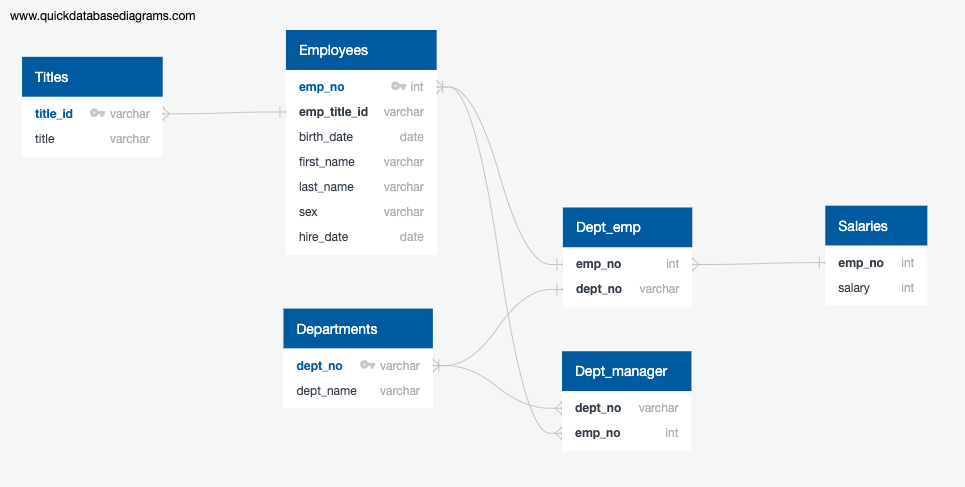

# sql-challenge

# summary
This repository takes 6 CSV files containing foreign/primary keys that link the data and loads them into a PostGreSQL database, then queries the data to obtain the information listed below.  

# Relationships 

SQL query using the relational diagram to find the following: 

* details of each employee
    * employee number
    * first and last name 
    * sex 
    * salary.
* details for all employees who were hired in 1986.
    * first and last name
    * hire date
* list of managers from each department with the following information:
    * department number
    * department name
    * employee number, 
    * first and last name
* department of each employee with the following information
    * employee number
    * first and last name 
    * department name.
* Name and sex for employees whose first name is "Hercules" and last names begin with "B."
* details for employees in the Sales department
    * employee number
    * first and last name 
    * department name.
* details employees in the Sales and Development departments
    * employee number
    * first and last name 
    * department name.
* frequency count of employee last names.

